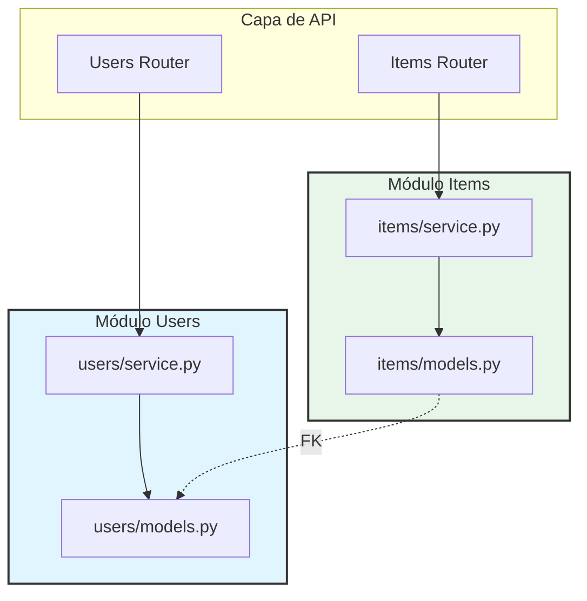

# Arquitectura del Backend

Este documento describe la evolución de la arquitectura del backend, pasando de un diseño monolítico por capas técnicas a una arquitectura modular basada en dominios (inspirada en DDD).

## 1. Arquitectura Original (Monolito por Capas)

En la versión original, el código estaba organizado por su función técnica. Todos los modelos de base de datos vivían en un solo archivo, y toda la lógica de negocio (CRUD) vivía en otro.

### Estructura de Archivos Original
```text
backend/app/
├── api/
│   └── routes/       # Controladores (Rutas)
├── models.py         # TODOS los modelos (User, Item, Token)
└── crud.py           # TODA la lógica de base de datos
```

### Diagrama de Dependencias Original

```mermaid
graph TD
    subgraph API [Capa de API]
        UserRouter[Users Router]
        ItemRouter[Items Router]
        LoginRouter[Login Router]
    end

    subgraph Logic [Capa Lógica Global]
        GlobalCRUD[crud.py<br/>(Contiene toda la lógica)]
    end

    subgraph Data [Capa de Datos Global]
        GlobalModels[models.py<br/>(User, Item, Token)]
    end

    UserRouter --> GlobalCRUD
    ItemRouter --> GlobalCRUD
    LoginRouter --> GlobalCRUD

    GlobalCRUD --> GlobalModels
    
    style GlobalCRUD fill:#f9f,stroke:#333,stroke-width:2px
    style GlobalModels fill:#f9f,stroke:#333,stroke-width:2px
```

**Problemas de este enfoque:**
- `crud.py` y `models.py` tienden a crecer indefinidamente (God Objects).
- Es difícil entender qué lógica pertenece a qué dominio.
- Cambiar algo en `User` puede romper algo en `Item` inesperadamente al compartir el mismo archivo.

---

## 2. Arquitectura Actual (Modular / DDD)

Hemos refactorizado el backend para agrupar el código por **Contexto de Dominio** (Users, Items, Auth). Ahora cada módulo es autocontenido y posee sus propios modelos, esquemas y servicios.

### Estructura de Archivos Actual
```text
backend/app/
├── api/
│   └── routes/           # Controladores (Rutas)
└── modules/              # Módulos de Dominio
    ├── users/
    │   ├── models.py     # Modelos de Usuario
    │   └── service.py    # Lógica de Usuario
    ├── items/
    │   ├── models.py     # Modelos de Item
    │   └── service.py    # Lógica de Item
    └── auth/
        └── schemas.py    # Esquemas de Autenticación
```

### Diagrama de Dependencias Actual



**Ventajas:**
- **Encapsulamiento:** Cada módulo maneja su propia complejidad.
- **Escalabilidad:** Es fácil agregar nuevos módulos (ej. `orders`, `payments`) sin tocar los existentes.
- **Mantenibilidad:** Los archivos son más pequeños y específicos.

## Guía Rápida

| Componente | Antes (Original) | Ahora (Nuevo) |
|------------|------------------|---------------|
| **Modelos DB** | `app/models.py` | `app/modules/<nombre>/models.py` |
| **Lógica CRUD** | `app/crud.py` | `app/modules/<nombre>/service.py` |
| **Esquemas Pydantic** | `app/models.py` | `app/modules/<nombre>/schemas.py` (o en models.py) |
